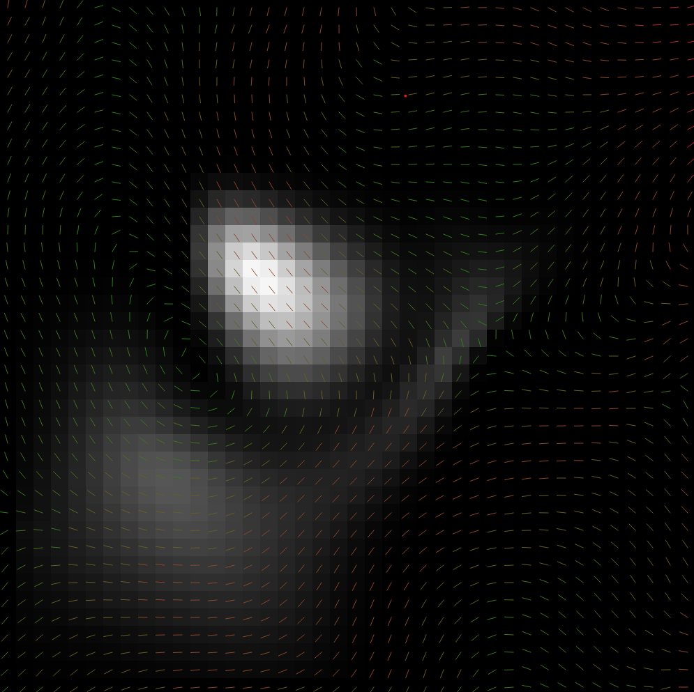
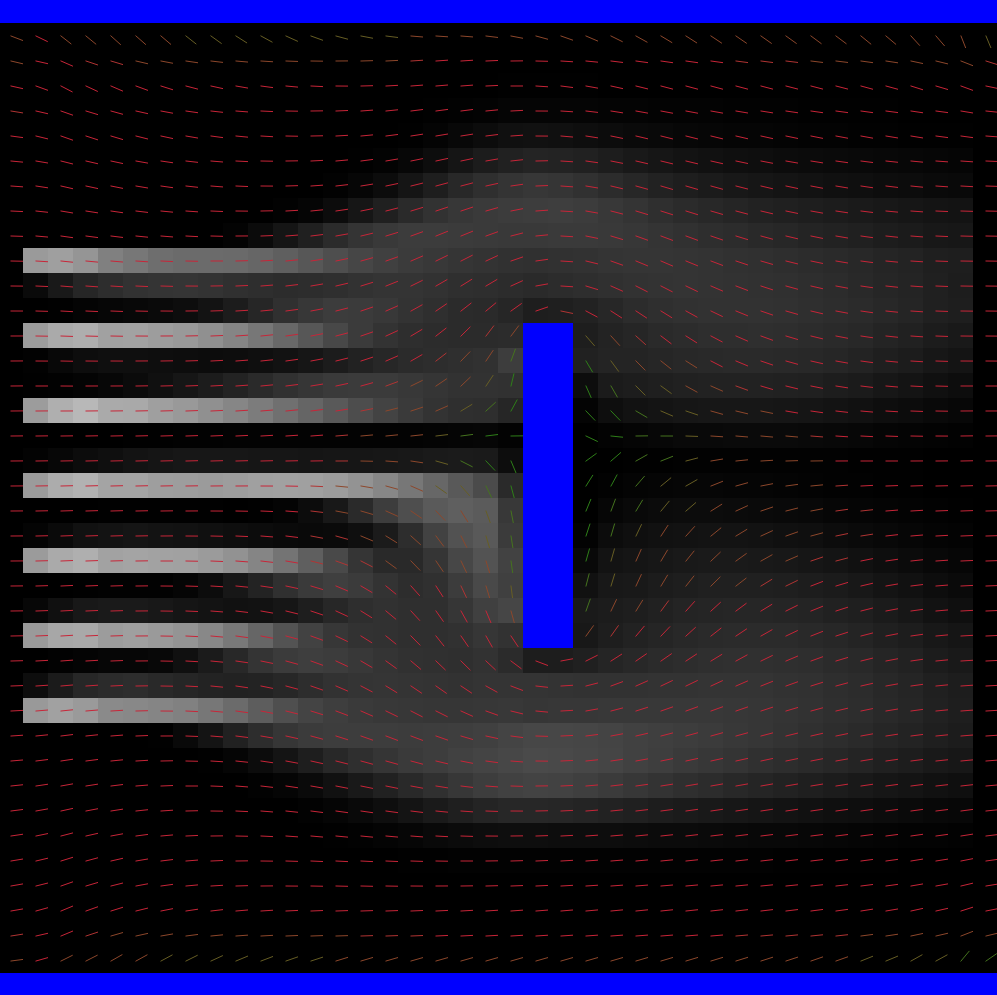

#  💨 Fluid simulator
This is a simple (in progress) fluid simulator made in python. It is not perfect, it does not exactly follow the laws of fluid dynamics, however they are part of the underlying concepts used to simulate. It is mainly focused on good visuals. So have fun and play around with it!

## Running the simulation
Make sure all the files are present. In the file `parameters.py`, certain parameters can be changed such as the size of the grid and the velocity field. Run the file `fluid_sim` to start the simulation. There are a lot of controls in order to use the simulation to its maximum potential:

### Keyboard:
- Press "1" for left wall, "2" for top wall, "3" for right wall, "4" for bottom wall
- Press "Esc" to exit the simulation
- Press "C" to remove all fluid
- Press "D" to increase the velocity
- Press "Space" to pause the simulation
- Press "I" to get information about the flow
- Press "H" to toggle the velocity field

### Mouse:
- Click left mouse button to spawn fluid
- Click right mouse button to spawn a obstacle

## Images
Here is an image of a random velocity field with some fluid flowing through it:

Here is an image of an obstacle in the simulation:

## Some credits
I used a paper written by Jos Stam, a video explaining this paper and some of my own knowledge and research to write this program. Links can be found below if you want to have a look yourself.

http://graphics.cs.cmu.edu/nsp/course/15-464/Fall09/papers/StamFluidforGames.pdf
https://www.youtube.com/watch?v=qsYE1wMEMPA

